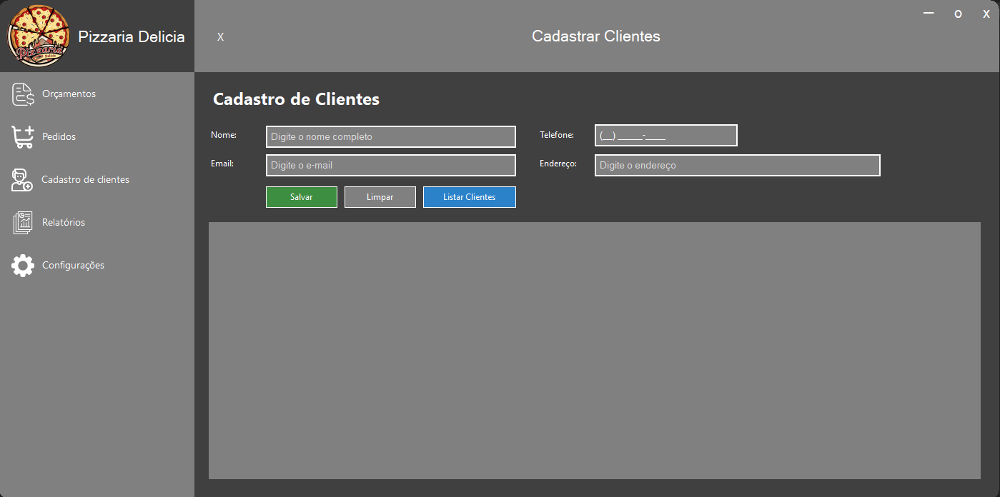
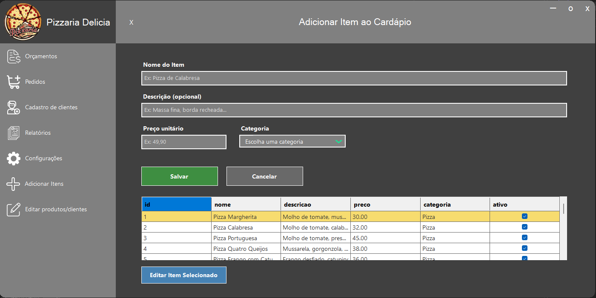
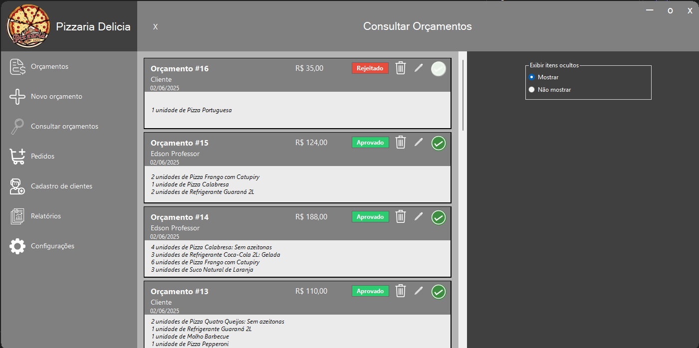
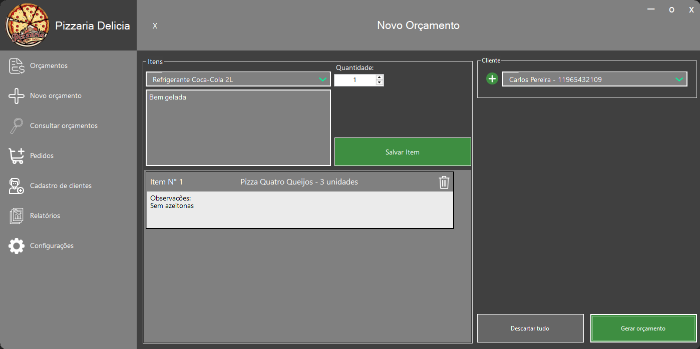
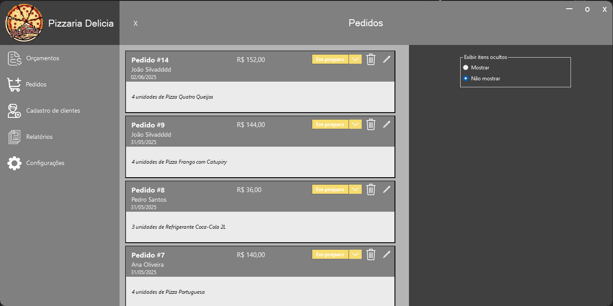
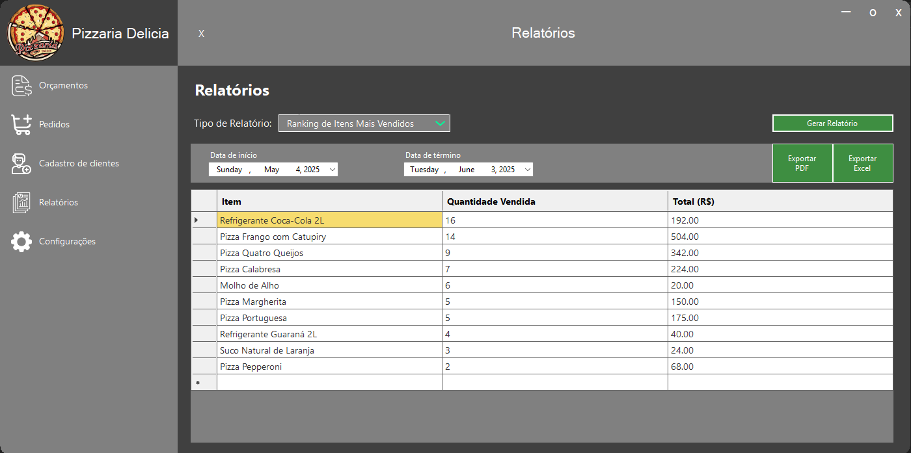

# 🍕 Nour - Sistema de Gestão de Pizzaria

Este é um sistema desktop feito em C# (Windows Forms) com banco de dados SQL Server, pensado para deixar a gestão da pizzaria mais simples e eficiente. Você pode cadastrar clientes, montar orçamentos, emitir pedidos, controlar produtos e gerar relatórios para acompanhar tudo de perto.

---

## 📌 Funcionalidades

- ✅ Cadastro rápido e fácil de Clientes  
- ✅ Cadastro completo de Itens (Pizzas, Bebidas e Adicionais)  
- ✅ Criação e edição de Orçamentos personalizados  
- ✅ Conversão automática de Orçamentos aprovados em Pedidos  
- ✅ Gestão dos Pedidos com status claros (Em produção, Finalizado, Cancelado)  
- ✅ Relatórios para acompanhar vendas, pedidos e clientes  
- ✅ Controle básico de estoque para monitorar os itens ativos

---

## 🧠 Tecnologias Utilizadas

- 💻 **Linguagem:** C# com Windows Forms  
- 🗄️ **Banco de Dados:** SQL Server (Express ou local)  
- 🔧 **IDE:** Visual Studio  
- 📊 **Arquitetura:** Aplicação local com banco SQL Server Express

---

## 🗺️ Estrutura do Banco de Dados

### 🔗 Tabelas

| Tabela              | Descrição                                       |
|---------------------|------------------------------------------------|
| **Clientes**        | Cadastro dos clientes                           |
| **Itens**           | Cardápio: Pizzas, Bebidas e Adicionais         |
| **Orcamentos**      | Orçamentos criados para clientes                |
| **Orcamento_Itens** | Itens vinculados a cada orçamento               |
| **Pedidos**         | Pedidos gerados a partir de orçamentos aprovados|
| **Pedido_Itens**    | Itens vinculados aos pedidos                     |

### 🔗 Relacionamentos

- Um **Cliente** pode ter vários **Orçamentos**.  
- Cada **Orçamento** inclui vários **Itens**.  
- Um orçamento aprovado vira automaticamente um **Pedido**.  
- Cada **Pedido** tem seus próprios itens.

---

## 🔥 Como Funciona na Prática

1. Cadastre seus clientes quando precisar.  
2. Monte um orçamento escolhendo os itens (pizzas, bebidas, adicionais).  
3. O orçamento pode:  
   - ✅ Ser **aprovado** e virar pedido automaticamente.  
   - ❌ Ser **rejeitado** ou alterado conforme o cliente desejar.  
4. Acompanhe o pedido com status:  
   - 🏗️ **Em produção**  
   - ✅ **Finalizado**  
   - ❌ **Cancelado**  
5. Use os relatórios para ver como estão as vendas, os clientes e o estoque.

---

## 📸 Telas do Sistema

| Tela                   | O que faz                          |
|------------------------|----------------------------------|
| Cadastro de Clientes    | Gerencia os dados dos clientes   |
| Cadastro de Itens       | Cadastre pizzas, bebidas e extras|
| Tela de Orçamentos      | Crie e controle orçamentos       |
| Tela de Pedidos         | Acompanhe pedidos em andamento   |
| Tela de Relatórios      | Visualize vendas, estoque e clientes |

---

### 📸 Exemplo das Telas

#### Cadastro de Clientes  


#### Cadastro de Itens  


#### Consulta de Orçamento  


#### Novo Orçamento  


#### Tela de Pedidos  


#### Tela de Relatórios  


---

## ⚠️ Observação sobre a Conexão com o Banco de Dados

Se você for usar este sistema, lembre de ajustar a conexão do banco na classe de conexão. O padrão é algo assim:

```csharp
String strConexao = "Password=123; Persist Security Info=True; User ID=sa; Initial Catalog=PizzariaDB; Data Source=" + Environment.MachineName;
```


Provavelmente vai precisar mudar o usuário, senha e o nome do servidor (Data Source) para o seu ambiente.

---

## 🏁 Como Executar o Projeto

1. Clone este repositório:

    ```bash
    git clone https://github.com/Lucas-Moreschi/nour-sistema-pizzaria.git
    ```

2. Abra a solução no Visual Studio (PrjPizzaria.sln).  
3. Configure a conexão com seu banco SQL Server Express ou local (veja a observação acima).  
4. Execute o script `PizzariaDB.sql` para criar as tabelas no banco.  
5. Rode o projeto (F5) e comece a usar.

---

## 🏗️ Melhorias Futuras

- Implantar sistema de delivery  
- Integrar pagamentos online  
- Criar dashboards com indicadores visuais  
- Melhorar o controle de estoque

---

## 🤝 Contribuição

Contribuições são super bem-vindas! Abra issues, faça sugestões e envie pull requests quando quiser.

---

## 🧑‍💻 Desenvolvedor

Lucas Moreschi Guerra  
Aluno de Ciência da Computação na Universidade Nove de Julho (UNINOVE)

---

## 📜 Licença

Este projeto foi criado como trabalho acadêmico e é disponibilizado para fins educacionais e de aprendizado.  
Não é permitida a utilização comercial ou redistribuição sem autorização prévia do autor.


